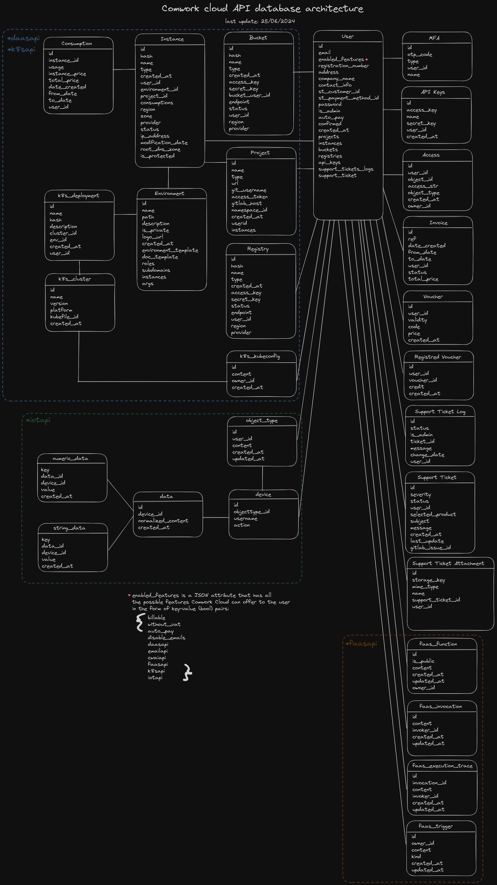

# Cwcloud CE RESTful API

## Git mirrors

* Main mirror: https://gitlab.comwork.io/oss/cwcloud/cwcloud-api.git
* Github mirror: https://github.com/comworkio/cwcloud-api.git
* Gitlab mirror: https://gitlab.com/ineumann/cwcloud-api.git

## Getting started with docker

### Prepare configurations

```shell
cp .env.dist .env
cp cloud_environments_local.yml.dist cloud_environments_local.yml
```

You can let run the API with thoses files, and you can also update the configurations or environment variables inside those files if needed.

### Run the containers

```shell
docker-compose -f docker-compose-local.yml up --build --force-recreate
```

### Test the database

```shell
$ docker exec -it comwork_cloud_db psql -U cloud cloud
psql (13.9 (Debian 13.9-1.pgdg110+1))
Type "help" for help.

cloud=# \d
                      List of relations
 Schema |               Name               |   Type   | Owner 
--------+----------------------------------+----------+-------
 public | access                           | table    | cloud
 public | access_id_seq                    | sequence | cloud
 public | api_keys                         | table    | cloud
 public | api_keys_id_seq                  | sequence | cloud
 public | bucket                           | table    | cloud
 public | bucket_id_seq                    | sequence | cloud
 public | consumption                      | table    | cloud
 public | environment                      | table    | cloud
 public | environment_id_seq               | sequence | cloud
 public | flyway_schema_history            | table    | cloud
```

### Init the FaaS token

```shell
docker exec -it comwork_cloud_db psql -U cloud cloud -c "INSERT INTO public.api_keys(name, access_key, secret_key, user_id) VALUES('faas', 'faas_access', 'faas_secret', (select id from public.user where is_admin = True and confirmed = True limit 1))"
```

### Test the API

```shell
$ curl localhost:5002/v1/health
{"alive":true, "ip":"172.21.0.1","status":"ok"}
$ curl localhost:5002/v1/manifest
{"sha": "unknown yet", "tag": "unknown yet"}
```

You can open the swagger GUI in your browser with this URL: http://localhost:5002

### Test the front (fullstack dev)

You can also run the front following the `README.md` of this repository: https://gitlab.comwork.io/comwork/infrastructure/comwork-cloud-ui

And updating this environment variable: `REACT_APP_APIURL=http://localhost:5002`

* Login: `sre-devops@comwork.io`
* Password: `cloud456`

### Unit tests

Here's how to run the unit test locally:

```shell
docker-compose -f docker-compose-build.yml up --build --abort-on-container-exit comwork_cloud_tests
```

## Linter

For our project, we're using `ruff` the fastest python linter. Here's how to run it locally:

```shell
docker-compose -f docker-compose-build.yml up --build --abort-on-container-exit comwork_cloud_linter
```

## Documentation

The restful API documentation is available here: https://doc.cloud.comwork.io/docs/tutorials/api/

You can also see the Swagger interface contracts here:
* Production environment (`main` branch): https://cloud-api.comwork.io
* Preproduction environment (`develop` branch): https://ppd.cloud-api.comwork.io

## Architectures
### Database

### FaaS


## Observability

Cwcloud-api is providing a `/metrics` http endpoint that can be scrapped by Prometheus:


If you're running locally with docker-compose, you can access to Jaegger UI here: http://localhost:9090

And can also send the metrics and some traces through OTLP/Grpc. Here's example of traces with Jaegger:


If you're running locally with docker-compose, you can access to Jaegger UI here: http://localhost:16686
